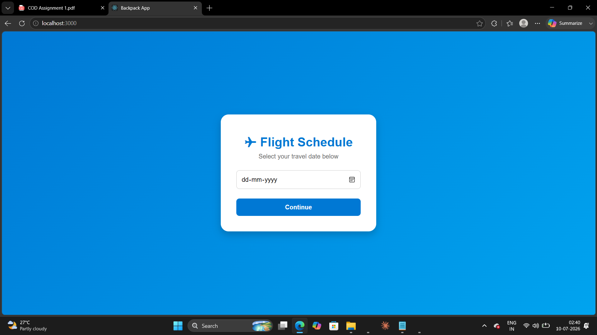
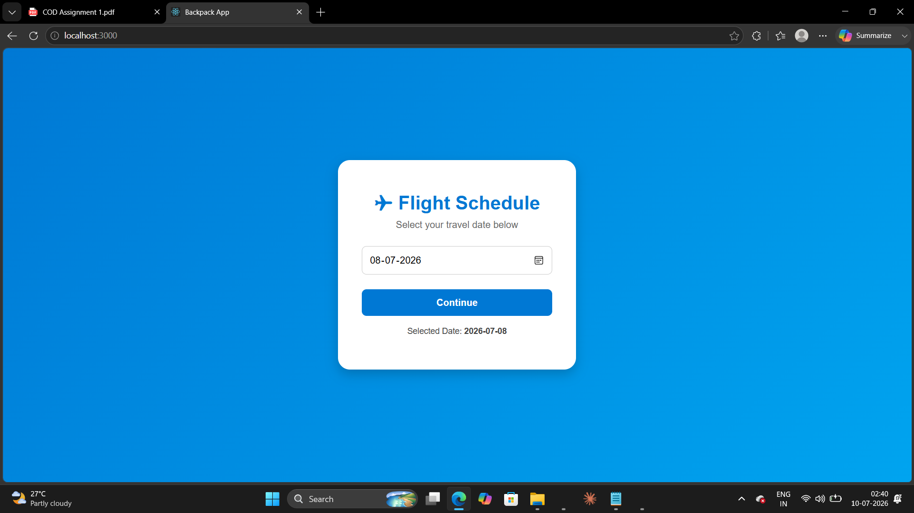
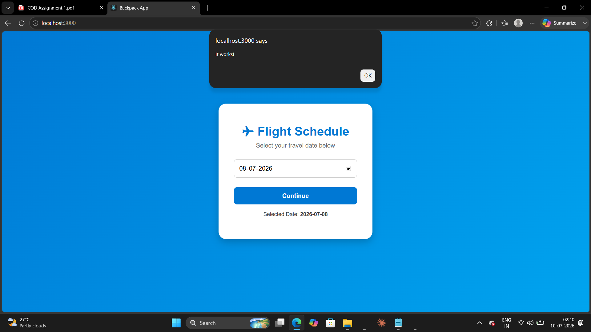

# ✈️ Flight Schedule App

## Overview

This project is a simple Flight Schedule web application built with React. It uses the Skyscanner Backpack Calendar component to allow users to select a travel date through an interactive calendar interface.

## Features

- Interactive calendar
- Date selection using React state
- Responsive user interface
- Continue button with click functionality
- Built using React functional components and Hooks

## Technologies Used

- React
- JavaScript (ES6)
- CSS / SCSS
- Skyscanner Backpack
- Backpack Calendar Component

## Installation

Clone the repository:

```bash
git clone https://github.com/your-username/flight-schedule-app.git
```

Install dependencies:

```bash
npm install
```

Install the Backpack Calendar package:

```bash
npm install bpk-component-calendar --save-dev
```

Start the application:

```bash
npm start
```

## Project Structure

```
src/
│── App.js
│── App.scss
│── index.js
```

## Application Preview

The application displays:

- Flight Schedule heading
- Interactive Calendar
- Continue button

## Learning Outcomes

- React Components
- React Hooks (`useState`)
- Third-party React libraries
- UI development with Backpack Design System

## Screenshots
Preview Output Images




## Author

**Darsh Sharma**
